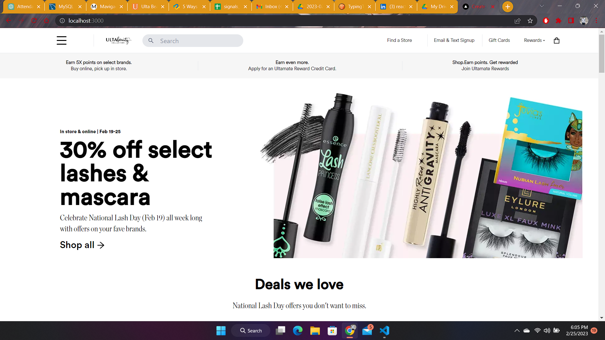

# ULTA Beauty Online Store
Ulta Beauty is an online store for all your beauty needs. Browse our wide selection of makeup, skincare, hair care, and fragrance products from top brands. This is a demo Next.js application for an online store called ULTA Beauty.

## Technologies Used
- Next.js
- React
- Tailwind CSS
- TypeScript
- JavaScript

## Features
- Browse products by category
- Search for products by name or description
- View product details and images
- Add products to cart and checkout

# Getting Started

1. Clone the repository
2. Install dependencies with `npm install`
3. Run the development server with `npm run dev`

## Deployment

This application can be deployed using any hosting service that supports Node.js applications.

# Credits
This application was created by [https://github.com/D3troit98](Duruaku Ebuka).

## Contributing

Contributions are welcome! If you find a bug or have a feature request, please create an issue on GitHub. If you would like to contribute to the codebase, please fork the repository and submit a pull request.

## License

This project is licensed under the MIT License - see the [LICENSE](LICENSE) file for details.

